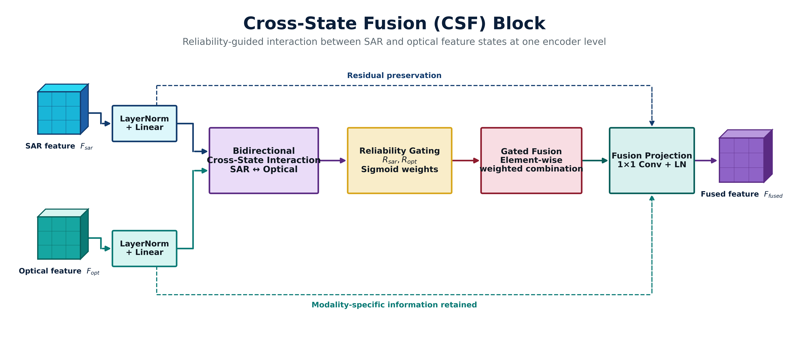

# TCSF
Tri-Level Cross-State Fusion Network  with Vision Mamba and Adaptive Reliability Learning for SAR-Optical Flood Mapping
TCSF

TCSF: A Tri-Level Cross-State Fusion Network with Vision Mamba and Adaptive Reliability Learning for SAR-Optical Flood Mapping

TCSF is a multimodal deep-learning framework for flood segmentation using co-registered Sentinel-1 SAR and Sentinel-2 optical imagery. The model combines reliability-aware multimodal learning, dual Vision Mamba encoders, bidirectional Cross-State Fusion, controlled cross-scale state propagation, and Adaptive Decision Fusion to improve flood delineation across heterogeneous scenes.

The implementation is developed in PyTorch and evaluated on SEN1FLOODS11, SEN12MS, and DEEPFLOOD. Experiments were conducted using an NVIDIA RTX A4000 GPU with 16 GB memory.

Paper status: Manuscript/preprint. A publication link and final bibliographic citation will be added after publication.

Contents

Introduction

Architecture

Key Highlights

Repository Structure

Dependencies

Dataset Preparation

Training

Testing

Inference

Results

Ablation Study

Baseline Models

Citation

Acknowledgements

Introduction

Flood mapping from satellite imagery is challenging because no single sensing modality is reliable under all conditions. Sentinel-1 SAR provides day-and-night, all-weather observations, but SAR imagery contains speckle noise and complex scattering responses. Sentinel-2 optical imagery provides rich spectral and spatial information, but its quality can be reduced by clouds, haze, shadows, and illumination changes.

TCSF is designed to exploit the complementary strengths of both modalities without simply concatenating them at the input. The framework preserves separate SAR and optical feature streams and allows information exchange only through reliability-guided fusion modules.

The proposed model contains four main ideas:

Modality Reliability Estimation to learn pixel-level confidence fields for SAR and optical observations.

Dual Vision Mamba Encoders to preserve modality-specific representations.

Tri-Level Cross-State Fusion to exchange and propagate SAR, optical, and fused states across multiple semantic scales.

Adaptive Decision Fusion to combine SAR-only, optical-only, and fused predictions using spatially varying learned weights.

The model uses Sentinel-1 VV/VH observations together with all 13 Sentinel-2 spectral bands during training and evaluation.

Architecture

Overall TCSF Framework

  

The TCSF framework consists of:

Sentinel-1 SAR input: VV and VH polarization channels.

Sentinel-2 optical input: 13 spectral bands.

Reliability estimation: pixel-level SAR and optical reliability maps.

Dual hierarchical Vision Mamba encoders: separate SAR and optical feature extraction.

Four Cross-State Fusion stages: bidirectional reliability-guided interaction between modalities.

Three controlled cross-scale transitions: propagation from scale 1→2, 2→3, and 3→4.

Three decoder branches: SAR, optical, and fused.

Adaptive Decision Fusion: learned pixel-wise weighting of the three segmentation predictions.

Final binary flood map: generated using a probability threshold of 0.5.

Cross-State Fusion

  

At each feature scale, TCSF applies bidirectional gated interaction between SAR and optical states. Cross-modal information is modulated by both feature compatibility and learned source reliability before being injected into the opposite modality stream.

This design allows TCSF to preserve modality-specific information while learning a complementary fused representation.

Controlled Tri-Level State Propagation

TCSF connects the four local Cross-State Fusion stages through three controlled transitions:

CSF1  →  T1  →  CSF2  →  T2  →  CSF3  →  T3  →  CSF4

Each transition propagates three state types:

SAR state
Optical state
Fused state

Learnable residual coefficients regulate the amount of information propagated between adjacent scales. The coefficients are bounded using tanh and initialized close to zero (1e-3) so that training begins with stable local fusion before progressively learning cross-scale dependence.

Across three transitions and three state types, the architecture learns nine interpretable propagation strengths.

Key Highlights

Reliability-Aware Multimodal Learning: Learns spatial confidence maps for SAR and optical inputs rather than assuming both modalities are equally reliable everywhere.

Dual Vision Mamba Encoders: Preserves modality-specific SAR scattering information and optical spectral-textural information using separate hierarchical state-space feature extractors.

Bidirectional Cross-State Fusion: Exchanges information between SAR and optical representations at four feature scales using gated, reliability-aware cross-modal state injection.

Tri-Level Controlled State Propagation: Propagates SAR, optical, and fused states through three encoder-level transitions using bounded learnable residual coefficients.

Adaptive Decision Fusion: Generates SAR-only, optical-only, and fused predictions and combines them through pixel-wise learned decision weights instead of fixed averaging.

Multi-Objective Training: Uses Binary Cross-Entropy, Dice, boundary, and inter-branch consistency losses to improve regional overlap, flood boundaries, and agreement between prediction branches.

Multimodal Evaluation: Evaluated on SEN1FLOODS11, SEN12MS, and DEEPFLOOD using co-registered Sentinel-1 and Sentinel-2 imagery.

Strong Accuracy-Complexity Trade-off: Achieves improved flood segmentation over CNN-, Transformer-, and Vision-Mamba-based baselines while using approximately 11.02 million trainable parameters.

Repository Structure

TCSF/
│
├── configs/                     # Training and model configurations
├── datasets/                    # Dataset loaders and preprocessing
├── engine/                      # Training / validation engine
├── losses/                      # Loss implementations
├── models/                      # TCSF and baseline architectures
├── scripts/                     # Model, loss, and dataset checks
├── utils/                       # Metrics, logging, checkpointing, visualization
│
├── outputs/
│   ├── logs/                    # Training logs
│   ├── predictions/             # Exported model predictions
│   ├── publication/             # Publication figures and analyses
│   └── test/                    # Test results
│
├── train.py                     # Train TCSF
├── test.py                      # Evaluate TCSF
├── infer.py                     # Generate TCSF predictions and visualizations
├── publication_evaluate.py      # Publication-oriented evaluation
├── benchmark_models.py          # Complexity and runtime benchmarking
├── plot_publication_curves.py   # Training / validation curve generation
├── generate_visual_comparison.py
└── requirements.txt

Model checkpoints are intentionally excluded from the repository.

Dependencies

The project uses Python and PyTorch. Install the required packages with:

pip install -r requirements.txt

Main dependencies include:

PyTorch

torchvision

torchaudio

NumPy

pandas

scikit-learn

scikit-image

OpenCV

Pillow

rasterio

tifffile

matplotlib

seaborn

tqdm

PyYAML

einops

timm

TensorBoard

Experimental Environment

The experiments reported in the manuscript were performed with:

GPU: NVIDIA RTX A4000
GPU Memory: 16 GB
Input Size: 256 × 256
Batch Size: 1
Optimizer: AdamW
Initial Learning Rate: 1e-4
Weight Decay: 1e-4
Scheduler: Cosine Annealing
Automatic Mixed Precision: Enabled
Gradient Clipping: 1.0

Dataset Preparation

TCSF uses co-registered Sentinel-1 SAR, Sentinel-2 optical imagery, and binary flood masks.

1. SEN1FLOODS11

Download the SEN1FLOODS11 dataset:

https://github.com/cloudtostreet/Sen1Floods11

Each sample uses:

Sentinel-1: VV + VH
Sentinel-2: 13 spectral bands
Label: Binary flood mask

The official train, validation, and test CSV partitions are retained.

2. SEN12MS

Download SEN12MS from:

https://mediatum.ub.tum.de/1474000

The experiments use paired Sentinel-1 and Sentinel-2 observations with the corresponding flood-label preparation used by this project.

3. DEEPFLOOD

Download DEEPFLOOD from:

https://figshare.com/articles/dataset/DEEPFLOOD_DATASET_High-Resolution_Dataset_for_Accurate_Flood_Mappingand_Segmentation/28328339

Input Preparation

All input images and labels are resized to:

256 × 256 pixels

Training augmentations must be applied consistently to SAR, optical, and label tensors so that their spatial correspondence is preserved.

For qualitative visualization, selected channels may be displayed for interpretability, such as Sentinel-1 VV and Sentinel-2 RGB. Training and evaluation use the complete multimodal input configuration.

Training

The main TCSF model is trained using train.py.

Example

python train.py \
    --config configs/acsf_base.yaml

The principal training protocol in the manuscript uses:

Epochs: 20
Seeds: 42, 123, 2026

A separate 200-epoch experiment is used for convergence and long-term optimization analysis.

Training Objective

The complete loss is composed of:

Ltotal =
    1.0 × LBCE
  + 1.0 × LDice
  + 0.2 × LBoundary
  + 0.1 × LConsistency

The best checkpoint is selected according to validation IoU.

Testing

Use test.py to evaluate a trained TCSF checkpoint.

python test.py \
    --config configs/acsf_base.yaml \
    --checkpoint outputs/checkpoints/TCSF_v31_seed2026/best_model.pth

The evaluation reports:

IoU
Dice / F1
Precision
Recall
Pixel Accuracy

The binary segmentation threshold is:

0.5

Checkpoints are not included in this GitHub repository and must be generated locally or obtained separately.

Inference

Use infer.py to generate predictions and qualitative visualizations.

python infer.py \
    --config configs/acsf_base.yaml \
    --checkpoint outputs/checkpoints/TCSF_v31_seed2026/best_model.pth \
    --save_dir outputs/predictions/TCSF_v31_seed2026

The inference pipeline can export:

Final flood prediction

SAR-only prediction

Optical-only prediction

SAR reliability map

Optical reliability map

Decision weights

Multimodal comparison figures

Results

Quantitative Comparison

TCSF was compared against U-Net, DeepLabV3+, SegFormer-B0, Swin-UNet, and Vision Mamba.

SEN1FLOODS11

Model

Params. (M)

IoU

Dice

Precision

Recall

Pixel Acc.

DeepLabV3+

40.38

0.4522

0.5585

0.6340

0.5976

0.9514

SegFormer-B0

3.73

0.4963

0.6009

0.6385

0.6084

0.9552

Swin-UNet

6.61

0.5187

0.6254

0.6412

0.6232

0.9586

U-Net

7.85

0.5236

0.6331

0.6498

0.6635

0.9613

Vision Mamba

5.57

0.5280

0.6320

0.6781

0.6948

0.9619

TCSF (Ours)

11.02

0.5803

0.6833

0.7653

0.6979

0.9680

SEN12MS

Model

Params. (M)

IoU

Dice

Precision

Recall

Pixel Acc.

DeepLabV3+

40.38

0.4387

0.5441

0.6215

0.5819

0.9476

SegFormer-B0

3.73

0.4824

0.5898

0.6267

0.5963

0.9518

Swin-UNet

6.61

0.5049

0.6137

0.6351

0.6104

0.9557

U-Net

7.85

0.5116

0.6208

0.6429

0.6467

0.9589

Vision Mamba

5.57

0.5198

0.6259

0.6672

0.6751

0.9596

TCSF (Ours)

11.02

0.5689

0.6764

0.7488

0.6895

0.9661

DEEPFLOOD

Model

Params. (M)

IoU

Dice

Precision

Recall

Pixel Acc.

DeepLabV3+

40.38

0.4678

0.5729

0.6473

0.6138

0.9536

SegFormer-B0

3.73

0.5095

0.6153

0.6516

0.6241

0.9571

Swin-UNet

6.61

0.5314

0.6376

0.6597

0.6412

0.9605

U-Net

7.85

0.5382

0.6451

0.6689

0.6724

0.9628

Vision Mamba

5.57

0.5467

0.6518

0.6935

0.7012

0.9637

TCSF (Ours)

11.02

0.5968

0.7019

0.7794

0.7146

0.9708

Overall Dataset Performance

Dataset

IoU

Dice

SEN1FLOODS11

0.5803

0.6833

SEN12MS

0.5689

0.6764

DEEPFLOOD

0.5968

0.7019

Computational Efficiency

For SEN1FLOODS11, TCSF achieves:

Trainable Parameters: 11.02 M
Macro IoU:            0.5803
Inference Latency:    77.1 ms/image

The model introduces additional computation relative to lightweight baselines, but provides a favorable accuracy-complexity trade-off and remains faster than DeepLabV3+ in the reported benchmark.

Ablation Study

The manuscript evaluates the contribution of the major TCSF components.

Reliability Estimation

Configuration

Macro IoU

Macro Dice

TCSF w/o Reliability

0.5576

0.6612

TCSF with Reliability

0.5612

0.6685

Cross-State Fusion

Configuration

Macro IoU

Macro Dice

TCSF w/o CSF

0.5489

0.6534

TCSF with CSF

0.5583

0.6596

Controlled Tri-Level Propagation

Configuration

Macro IoU

Macro Dice

TCSF w/o Tri-Level Propagation

0.4521

0.5567

TCSF with Tri-Level Propagation

0.5797

0.6833

Adaptive Decision Fusion

Configuration

Macro IoU

Macro Dice

TCSF w/o ADF

0.5594

0.6638

TCSF with ADF

0.5623

0.6693

The controlled tri-level propagation mechanism produces the largest performance change among the reported component ablations, supporting the importance of progressive cross-scale state transfer.

Baseline Models

The repository also contains training, testing, and inference implementations for the evaluated baselines:

U-Net
DeepLabV3+
SegFormer-B0
Swin-UNet
Vision Mamba

Example baseline scripts include:

train_unet.py
test_unet.py
infer_unet.py

train_deeplabv3plus.py
test_deeplabv3plus.py
infer_deeplabv3plus.py

train_segformer.py
test_segformer.py
infer_segformer.py

train_swin_unet.py
test_swin_unet.py
infer_swin_unet.py

train_vision_mamba.py
test_vision_mamba.py
infer_vision_mamba.py

Citation

If you find this repository useful in your research, please cite the TCSF manuscript.

@unpublished{talreja2026tcsf,
  author = {Jagrati Talreja and Tewodros Syum Gebre and Leila Hashemi Beni},
  title  = {TCSF: A Tri-Level Cross-State Fusion Network with Vision Mamba and Adaptive Reliability Learning for SAR-Optical Flood Mapping},
  year   = {2026},
  note   = {Preprint submitted to Elsevier}
}

The citation will be updated when the final publication information becomes available.

Acknowledgements

This research was conducted at the College of Science and Technology, North Carolina A&T State University.

The authors acknowledge the developers and maintainers of the SEN1FLOODS11, SEN12MS, and DEEPFLOOD datasets, as well as the open-source PyTorch and remote-sensing research communities that support reproducible multimodal Earth-observation research.

Authors

Jagrati Talreja
College of Science and Technology, North Carolina A&T State University

Tewodros Syum Gebre
College of Science and Technology, North Carolina A&T State University

Leila Hashemi Beni
College of Science and Technology, North Carolina A&T State University
Institute for Water, Environment and Health, United Nations University

License

Please refer to the repository license for terms of use. If no license has yet been added, the code remains subject to the copyright of the authors.
