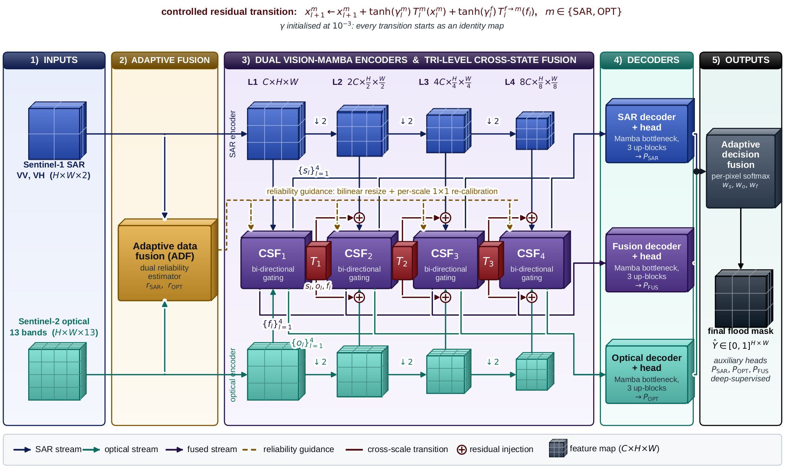
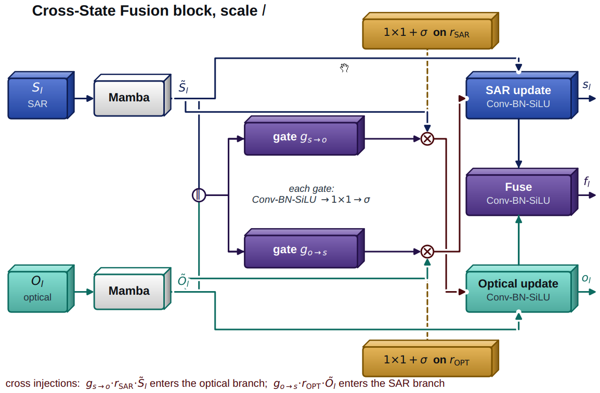
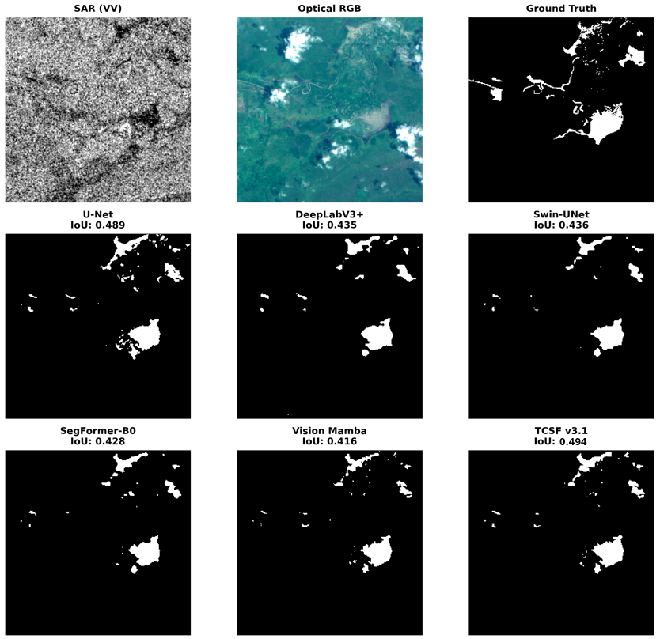
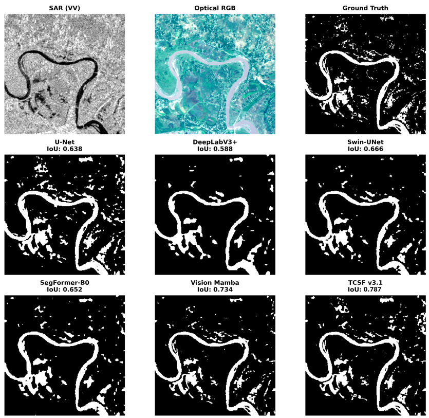
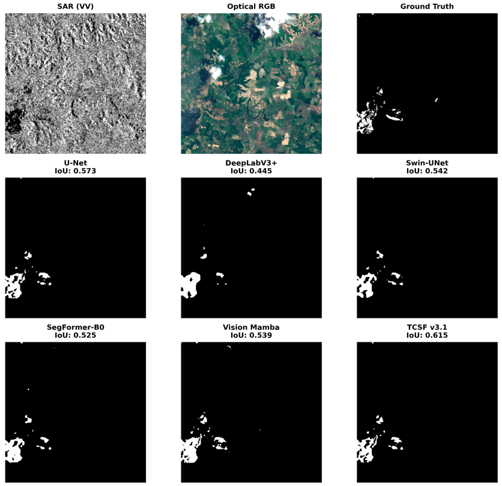
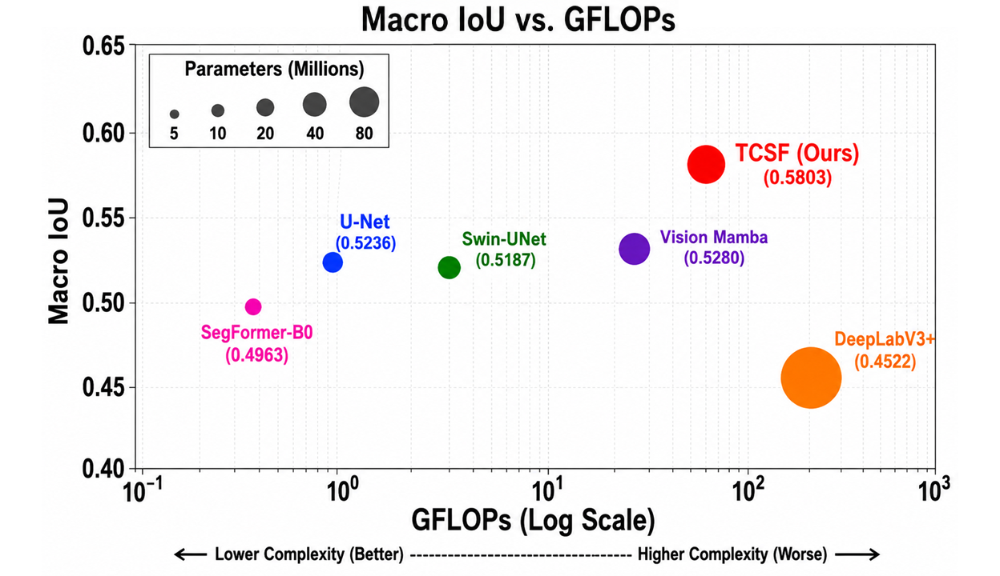
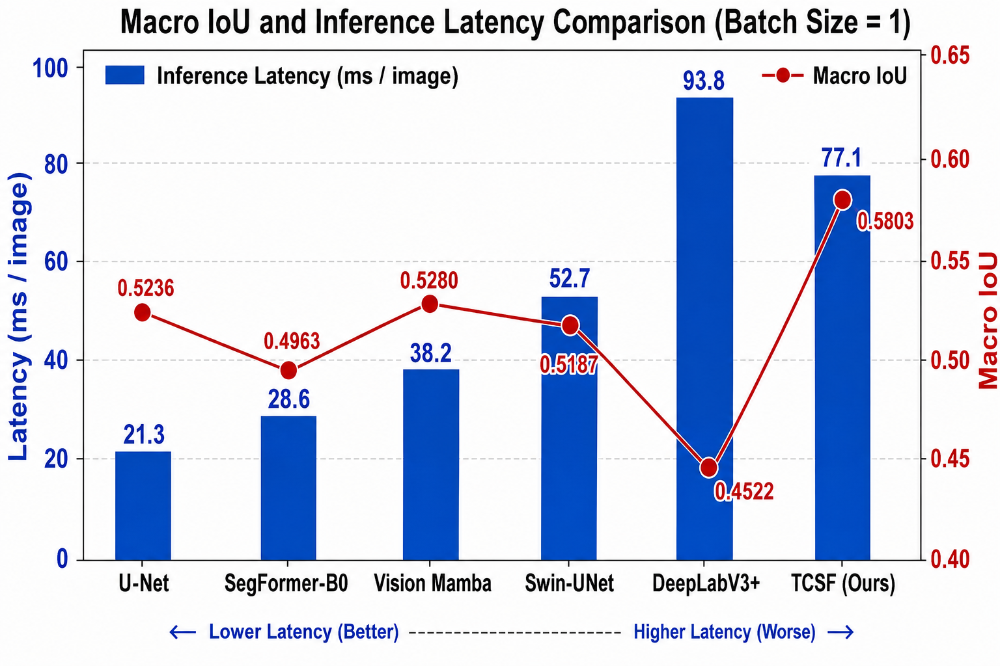
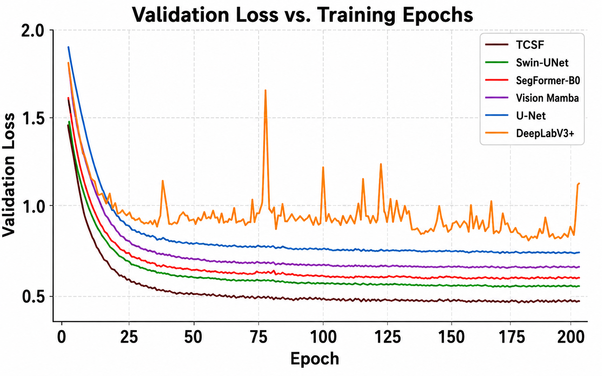
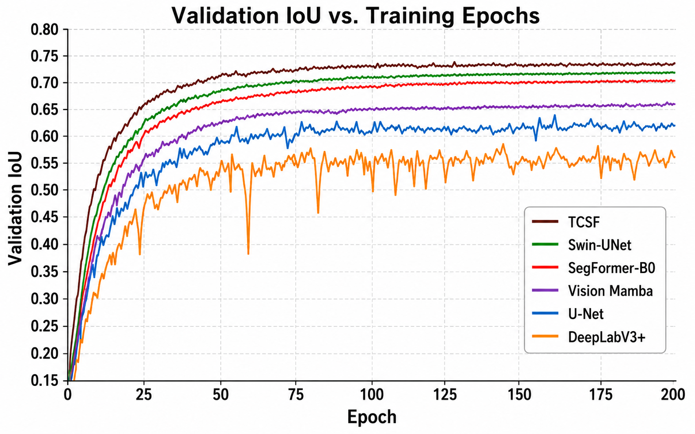
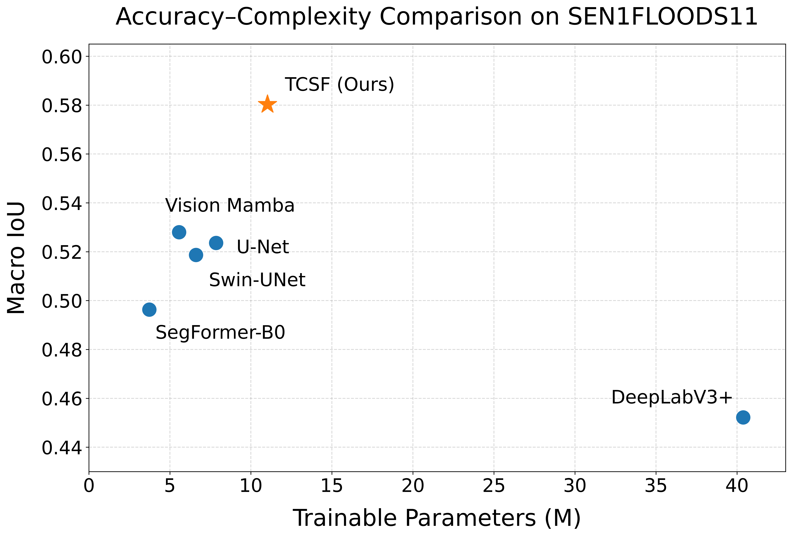

# TCSF

TCSF: A Tri-Level Cross-State Fusion Network with Vision Mamba and Adaptive Reliability Learning for SAR-Optical Flood Mapping

TCSF is a multimodal deep-learning framework for flood segmentation using co-registered Sentinel-1 SAR and Sentinel-2 optical imagery. The model combines reliability-aware multimodal learning, dual Vision Mamba encoders, bidirectional Cross-State Fusion, controlled cross-scale state propagation, and Adaptive Decision Fusion to improve flood delineation across heterogeneous scenes.

The implementation is developed in PyTorch and evaluated on SEN1FLOODS11, SEN12MS, and DEEPFLOOD. Experiments were conducted using an NVIDIA RTX A4000 GPU with 16 GB memory.

Paper status: Manuscript/preprint. A publication link and final bibliographic citation will be added after publication.

## Contents
1. [Introduction](#introduction)
2. [Key Highlights](#keyhighlights)
3. [Dependencies](#dependencies)
4. [Train](#train)
5. [Test](#test)
6. [Results](#results)
7. [Citation](#citation)
8. [Acknowledgements](#acknowledgements)

## Introduction

Flood mapping benefits from combining Sentinel-1 SAR and Sentinel-2 optical imagery because the two modalities provide complementary information. SAR offers all-weather, day-and-night observations but is affected by speckle noise and complex scattering, while optical imagery provides rich spectral information but can be degraded by clouds, haze, and shadows.

TCSF — **Tri-Level Cross-State Fusion Network** — is a reliability-aware multimodal framework that maintains separate SAR and optical feature streams rather than directly concatenating the inputs. It combines **Modality Reliability Estimation, dual Vision Mamba encoders, Cross-State Fusion, controlled tri-level state propagation, and Adaptive Decision Fusion** to learn complementary multimodal representations for flood segmentation.

The model uses Sentinel-1 VV/VH and all 13 Sentinel-2 spectral bands.

### Overall TCSF Framework

<p align="center">
  
</p>

TCSF uses four reliability-guided Cross-State Fusion stages connected through three controlled cross-scale transitions. SAR, optical, and fused states are progressively propagated across encoder scales and decoded through separate prediction branches. Adaptive Decision Fusion then combines the three predictions using learned pixel-wise weights.

### Cross-State Fusion

<p align="center">
  
</p>

Cross-State Fusion enables bidirectional interaction between SAR and optical features while using learned modality reliability to control cross-modal information exchange. Three controlled transitions connect the four fusion stages:

**CSF1 → T1 → CSF2 → T2 → CSF3 → T3 → CSF4**

Each transition propagates SAR, optical, and fused states using bounded learnable residual coefficients.

## Key Highlights

* **Reliability-Aware Fusion:** Learns pixel-level SAR and optical confidence maps to reduce the influence of unreliable observations.

* **Dual Vision Mamba Encoders:** Preserve modality-specific information while capturing long-range spatial dependencies.

* **Tri-Level Cross-State Fusion:** Performs reliability-guided multimodal interaction at four scales with controlled state propagation across three transitions.

* **Adaptive Decision Fusion:** Combines SAR-only, optical-only, and fused predictions using learned pixel-wise weights.

* **Multi-Objective Training:** Uses BCE, Dice, boundary, and consistency losses for accurate flood-region and boundary prediction.

* **Multi-Dataset Evaluation:** Evaluated on SEN1FLOODS11, SEN12MS, and DEEPFLOOD against CNN-, Transformer-, and Vision Mamba-based baselines.

## Dependencies
* Python 3.1
* PyTorch >= 1.1.0
* CUDA 12.2
* numpy
* skimage
* **imageio**
* matplotlib
* tqdm
* cv2 >= 3.xx (Only if you want to use video input/output)

### Begin to train

Use the `train.py` file to begin training the TCSF model.

```bash
# Example Training
python train.py \
    --config configs/acsf_base.yaml
```

## Test

### Quick start

1. Download the [DEEPFLOOD dataset](https://figshare.com/articles/dataset/DEEPFLOOD_DATASET_High-Resolution_Dataset_for_Accurate_Flood_Mappingand_Segmentation/28328339).

2. Download the [SEN1FLOODS11 dataset](https://github.com/cloudtostreet/Sen1Floods11).

3. Download the [SEN12MS dataset](https://mediatum.ub.tum.de/1474000).

4. Prepare the corresponding Sentinel-1 SAR, Sentinel-2 optical imagery, and flood masks.

Use the `test.py` file to evaluate the trained model.

```bash
# Example Testing
python test.py \
    --config configs/acsf_base.yaml \
    --checkpoint outputs/checkpoints/TCSF_v31_seed2026/best_model.pth
```

Use the `infer.py` file to generate prediction maps and visual results.

```bash
# Example Inference
python infer.py \
    --config configs/acsf_base.yaml \
    --checkpoint outputs/checkpoints/TCSF_v31_seed2026/best_model.pth \
    --save_dir outputs/predictions/TCSF_v31_seed2026
```

## Results

TCSF achieves an IoU of **0.5803** on SEN1FLOODS11, **0.5689** on SEN12MS, and **0.5968** on DEEPFLOOD.

### Visual Results

Qualitative results include the SAR input, optical imagery, ground-truth flood mask, final prediction, modality-specific predictions, and learned reliability maps.

<!-- Add your qualitative result figures here -->







### Computational Complexity and Training Analysis

TCSF was further evaluated in terms of training convergence and computational efficiency. The following curves compare TCSF with the baseline models in terms of validation IoU, validation loss, inference latency, and computational complexity.











TCSF achieves a strong balance between segmentation accuracy and computational cost, with **11.02M trainable parameters**, **0.5803 Macro IoU**, and an inference latency of **77.1 ms/image** at a batch size of 1.


## Citation

If you find the code helpful in your research or work, please cite the following paper.

```bibtex
@unpublished{talreja2026tcsf,
  author={Talreja, Jagrati and Gebre, Tewodros Syum and Hashemi-Beni, Leila},
  title={TCSF: A Tri-Level Cross-State Fusion Network with Vision Mamba and Adaptive Reliability Learning for SAR-Optical Flood Mapping},
  year={2026},
  note={Manuscript under review}
}
```

The citation will be updated with the final publication information after publication.

## Acknowledgements

This research article has been made possible by the support of the National Aeronautics and Space Administration (NASA) Award 80NSSC23M0051 and the National Science Foundation (NSF) Award 2401942.

We thank the developers of SEN1FLOODS11, SEN12MS, and DEEPFLOOD for making their datasets publicly available. We also acknowledge the open-source PyTorch and Vision Mamba research communities whose tools and implementations supported this work.
